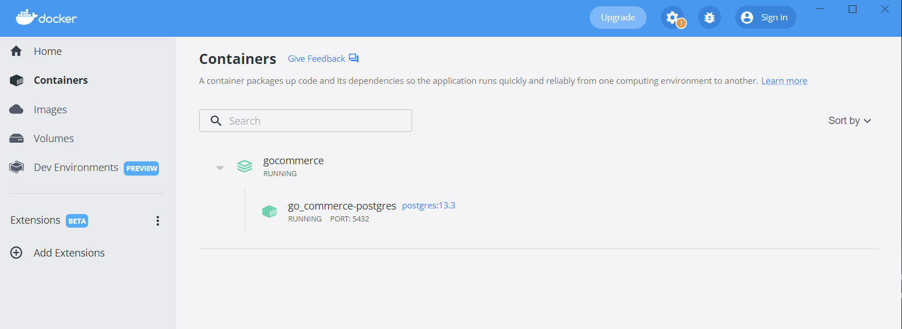
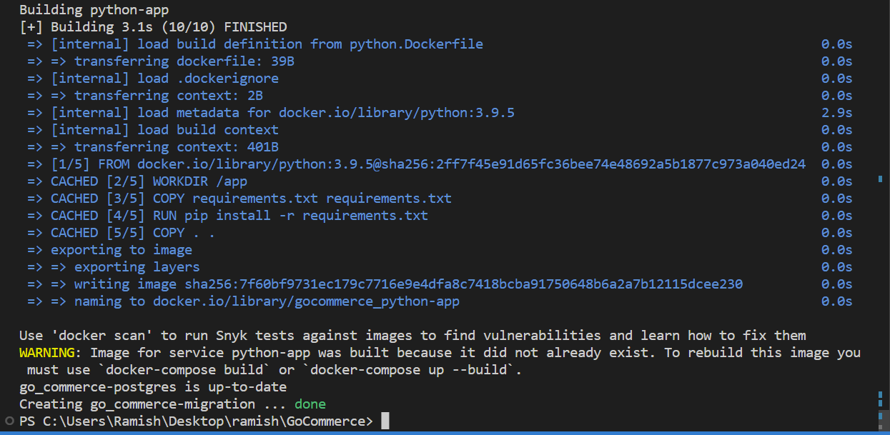
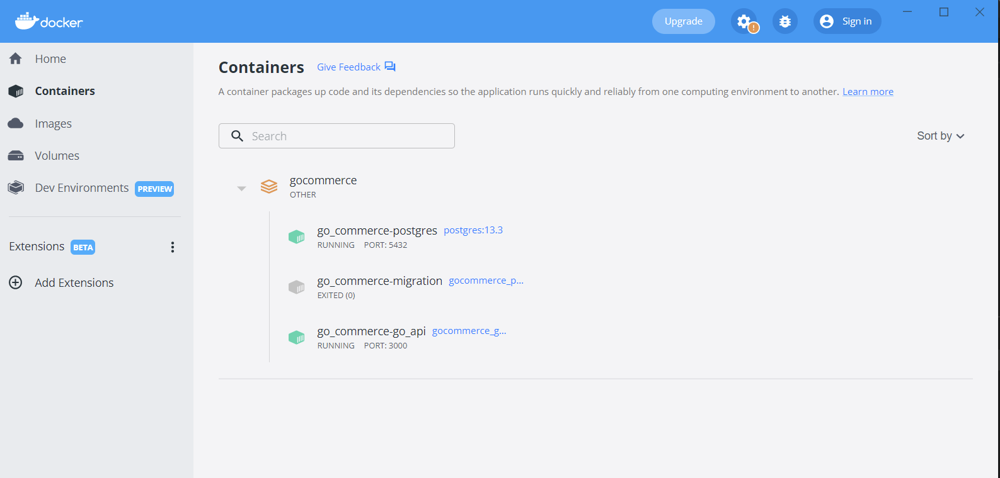
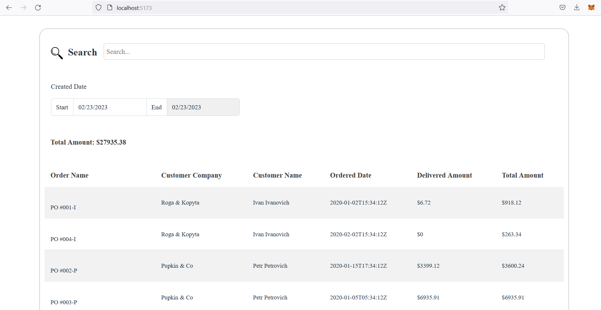
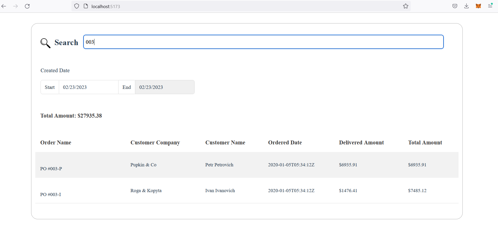

# GoCommerce
A simple application for order listing and filtering using Go Fiber, Vue.js, PostgreSQL &amp; Python.

## Technologies
#### Go Fiber
Fiber is a Go web framework built on top of Fasthttp, the fastest HTTP engine for Go. It's designed to ease things up for fast development with zero memory allocation and performance in mind.

#### Vue.js
Vue is a progressive JavaScript framework that provides a declarative and component-based programming model that helps you efficiently develop user interfaces, be they simple or complex.

#### PostgreSQL
PostgreSQL is an object relational database management system which is a system used for managing data in relations, or tables which are grouped into databases, so you can have multiple tables in one database.

#### Docker
Docker is a platform for developers to develop, deploy, and run applications with containers since containers are portable, lightweight and stackable.

## Project Description
In this project, REST APIs are developed in Go Fiber framework and is integrated with PostgreSQL along with its migration scripts. Frontend is made of Vue. 5 excel sheets are imported into the application and a DB relation is also set up by using Python scripts. This application lists all the customer orders, search orders by part of the order or product name, filter orders by date range utilizing data of 5 different tables joined together.

## Running the Application
1. Clone the respository into your local system
> git clone https://github.com/RamishUrRehman007/GoCommerce.git

2. Run the following Docker Build commands to setup database and application
> docker-compose up -d postgres 
> docker-compose exec postgres sh -c '/mnt/migration.sh -d go_commerce' 

3. Now, run the following command to setup the python image to migrate data
> docker-compose up -d python-app

5. Let's Up the Go App and run following commands:
> docker-compose up -d go-api
> cd .\vue-front\
> npm install
> npm run dev

 
4. Now run the application using [http://localhost:5173/]

 

